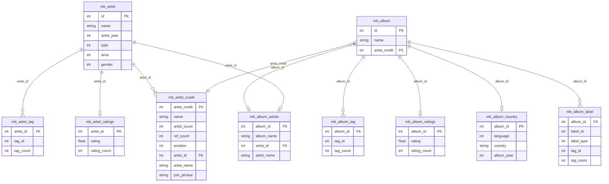
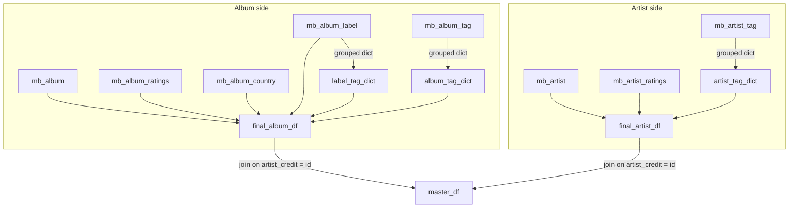
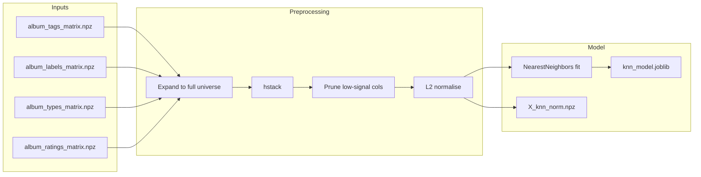
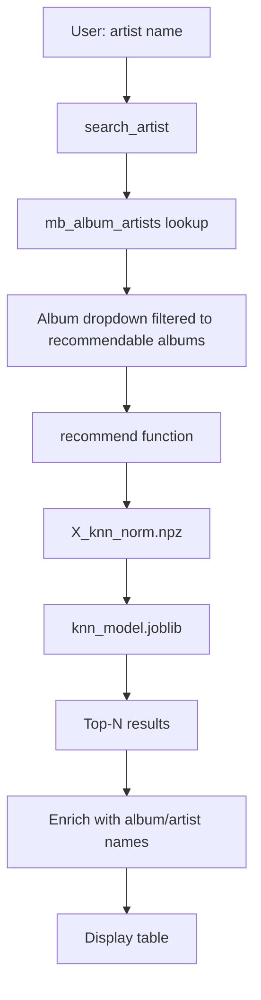

# Schema Diagrams

Visual reference for how the Parquet tables relate to each other and how they are combined into the training pipeline.

## Raw Parquet table relationships

## Dataset construction joins

How the parquet tables are combined in `datasets/parquet-dataframes.ipynb`:

## Feature matrix construction

How `final_album_df` and supporting tables feed into the feature matrices:

## App data flow

