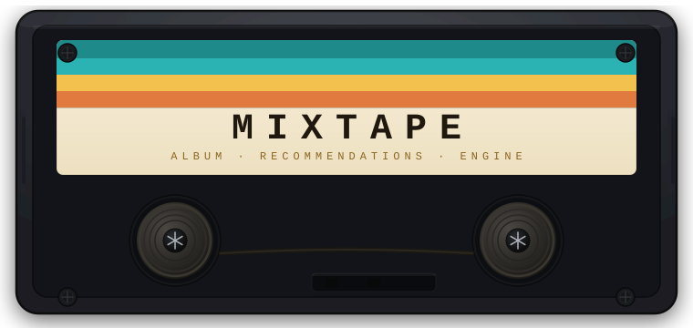

<p align="center">
  
</p>

<p align="center">
  
  &nbsp;
  
  &nbsp;
  
  &nbsp;
  
</p>

---

**Mixtape** finds albums you'll love based on one you already do. Pick any album, adjust six dials — genre, era, country, label, track feel, popularity — and get ten recommendations tuned exactly to what you're after. Powered by the full MusicBrainz catalogue. No account, no streaming service, no internet after setup.

---

## ` WHAT YOU NEED `

```
▸  A computer — macOS, Windows, or Linux
▸  Python 3.11   →   python.org/downloads
▸  ~500 MB free disk space
▸  A terminal / command prompt
```

That's it. Once set up, the app runs entirely on your machine.

---

## ` GETTING STARTED `

### Step 1 — Download

Click the green **`Code ▾`** button at the top of this page → **Download ZIP**.  
Unzip it somewhere easy to find, like your Desktop.

> Comfortable with git? `git clone https://github.com/yourusername/mixtape-app.git`

---

### Step 2 — Open a terminal inside the folder

| System | How |
|--------|-----|
| **Mac** | Right-click the `mixtape-app` folder → _New Terminal at Folder_ |
| **Windows** | Open the folder → click the address bar → type `cmd` → press Enter |
| **Linux** | Right-click the folder → _Open Terminal_ |

---

### Step 3 — Set up Python

Paste these two lines into your terminal, pressing **Enter** after each:

```bash
python3 -m venv env
```

```bash
source env/bin/activate
```

> **Windows:** second line is `env\Scripts\activate`

You'll see `(env)` appear at the start of your prompt — that means it worked.

---

### Step 4 — Install packages

```bash
pip install -r requirements.txt
```

Takes about a minute the first time.

---

### Step 5 — Press play

```bash
streamlit run app/app.py
```

A browser window opens at **`http://localhost:8505`** automatically.  
First load takes 20–30 seconds while 1.7 million albums load into memory. After that, every search is instant.

---

## ` USING MIXTAPE `

### Find Similar Albums

1. **Type an artist name** in the search box and pick from the dropdown
2. **Choose an album** from their discography
3. Hit **Find Similar** — you'll get 10 recommendations with a similarity score

---

### The Mixing Desk

The sidebar has **six dials**, like a mixing desk. Turn them to shape what drives the recommendations:

```
╔══════════════════════════════════════════════════════╗
║  GENRE       Match by musical style and tags         ║
║  RECORD LBL  Albums from the same label family       ║
║  COUNTRY     Music from the same country or region   ║
║  TRACK STATS Similar album length and song durations ║
║  ERA         Same decade or musical period           ║
║  POPULARITY  Similar critical and listener reception ║
╚══════════════════════════════════════════════════════╝
```

`0` = this signal ignored entirely &nbsp;·&nbsp; `11` = this signal dominates

---

### Presets

Not sure where to start? Hit a preset to load a pre-tuned mix:

| Preset | What it does |
|--------|-------------|
| **Full Mix** | Balanced blend of everything — good starting point |
| **Genre Purist** | Style only. Labels, country, era all off |
| **Same Vibe, New Artist** | Similar sound and era, across different artists |
| **Local Sound** | Music from the same country or region |
| **Critics' Pick** | Albums with similar recognition and reception |

---

### Auto-Tune

Hit the **Auto-Tune** button after selecting an album. Mixtape analyses how much useful signal each feature has for that specific album and sets the dials accordingly. Works best on well-documented albums.

---

### Content Filters

Two faders at the bottom of the sidebar let you control what shows up in results:

- **Live Albums** — Studio only / Both / Live only
- **Greatest Hits** — Albums only / Both / Compilations only

---

### Explore Tab

Don't have a specific album in mind? Switch to the **Explore** tab. Pick genre tags, a country, and a decade — Mixtape surfaces albums that match. Click any result to feed it straight into Find Similar.

---

## ` TROUBLESHOOTING `

<details>
<summary><b>The app won't start</b></summary>

Make sure you ran `source env/bin/activate` first — the `(env)` prefix should be visible in your terminal. Then try `pip install -r requirements.txt` again.

</details>

<details>
<summary><b>Browser doesn't open automatically</b></summary>

Go to `http://localhost:8505` manually in any browser.

</details>

<details>
<summary><b>Port already in use</b></summary>

Something else is running on port 8505. Use:
```bash
streamlit run app/app.py --server.port 8506
```

</details>

<details>
<summary><b>Very slow on first load</b></summary>

Normal — the app indexes 1.7 million albums into memory on first startup. Searches after that are fast. Don't close the browser tab between searches.

</details>

---

## ` THE DATA `

Mixtape draws from two open data sources:

**[MusicBrainz](https://musicbrainz.org)** — a community-maintained music encyclopaedia covering 1.7 million albums. Provides genre tags, record label history, country of origin, track statistics, and release era.

**[Last.fm](https://www.last.fm)** — listener play counts and scrobble data, used to build the Popularity signal. Albums with more listener engagement score higher on this dial.

No streaming service connection. No personal data collected.

---

<p align="center">
  <sub>
    ◀◀ &nbsp; ■ &nbsp; ▶ &nbsp; ▶▶ &nbsp;&nbsp;&nbsp; · &nbsp;&nbsp;&nbsp; MIX<b>TAPE</b> · TPS-90 STEREO &nbsp;&nbsp;&nbsp; · &nbsp;&nbsp;&nbsp; ◀◀ &nbsp; ■ &nbsp; ▶ &nbsp; ▶▶
  </sub>
</p>
