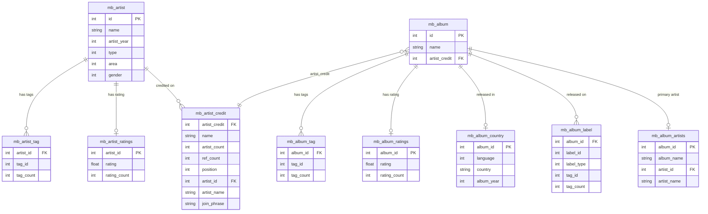

# Data Import — Parquet Tables

**Notebook:** `1-data/01-postgres-to-parquet.ipynb`

Connects to a local MusicBrainz PostgreSQL instance via DuckDB's Postgres extension, then exports filtered subsets to compressed Parquet files in `data/`.

## Prerequisites

- MusicBrainz PostgreSQL database running at `localhost:5432`
- Connection credentials in `.env` (see `.env.example`)

## How it works

DuckDB attaches to Postgres as a read-only data source:

```python
duck_con.execute("""INSTALL postgres; LOAD postgres;""")
duck_con.execute(f"""
    ATTACH IF NOT EXISTS 'host=... dbname=musicbrainz_db ...'
    AS mb_pg (TYPE postgres, READ_ONLY);
""")
```

Each table is exported with `COPY (...) TO '../data/<name>.parquet' (FORMAT 'PARQUET', COMPRESSION 'ZSTD')`.

## Tables exported

### Artist tables

| File | Source | Key fields |
|------|--------|------------|
| `mb_artist.parquet` | `musicbrainz.artist` | `id`, `name`, `artist_year`, `type`, `area`, `gender` |
| `mb_artist_tag.parquet` | `musicbrainz.artist_tag` | `artist_id`, `tag_id`, `tag_count` |
| `mb_artist_ratings.parquet` | `musicbrainz.artist_meta` | `artist_id`, `rating`, `rating_count` |
| `mb_artist_credit.parquet` | `artist_credit` + `artist_credit_name` | `artist_credit`, `name`, `artist_count`, `ref_count`, `position`, `artist_id`, `artist_name`, `join_phrase` |

### Album tables

| File | Source | Key fields |
|------|--------|------------|
| `mb_album.parquet` | `valid_albums` (scoped: studio + official live + best-of) | `id`, `name`, `artist_credit` |
| `mb_album_tag.parquet` | `release_group_tag` | `album_id`, `tag_id`, `tag_count` |
| `mb_album_ratings.parquet` | `release_group_meta` | `album_id`, `rating`, `rating_count` |
| `mb_album_country.parquet` | `release` + `release_country` | `album_id`, `language`, `country`, `album_year` |
| `mb_album_label.parquet` | `release_label` + `label` + `label_tag` | `album_id`, `label_id`, `label_type`, `tag_id`, `tag_count` |
| `mb_album_artists.parquet` | `release_group` + `artist_credit_name` | `album_id`, `album_name`, `artist_id`, `artist_name` |

## Schema diagram



## Last.fm scraper (`1-data/05-lastfm-scraper.ipynb`)

Parallel web scraper that collects listener and scrobble counts from Last.fm for every (artist, album) pair in `mb_album_artists.parquet`. Outputs `data/lastfm_data.parquet`, which feeds the popularity feature matrix built in `3-features/13-feature-lastfm-popularity.ipynb`.

| Config | Default | Notes |
|--------|---------|-------|
| `WORKER_ID` | 0 | Unique per VSCode window (0–3) |
| `TOTAL_WORKERS` | 4 | How many parallel windows are running |
| `SAVE_EVERY` | 50 | Flush to parquet every N rows |
| `START_FROM` | None | Manual row range start (overrides auto slice) |
| `END_AT` | None | Manual row range end |

Multiple workers can run simultaneously — `filelock` prevents write races and each worker refreshes its done-set every 500 rows to skip rows already scraped by others. The scraper is resumable; re-running from the same `WORKER_ID` automatically skips already-scraped (artist, album) pairs.

**Output:** `data/lastfm_data.parquet` — 207,893 rows × 9 columns (`Artist`, `Album`, `Artist_Listeners`, `Artist_Scrobbles`, `Album_Listeners`, `Album_Scrobbles`, `Similar_Artists`, `Artist_URL`, `Album_URL`). Numeric columns are stored as comma-formatted strings and cleaned in the feature notebook.

### Flag queries (`1-data/queries/`)

Two DuckDB SQL queries export album-type flags from the MusicBrainz Postgres instance, used by the Live Albums and Greatest Hits faders in the app.

| Query file | Output parquet | Secondary type |
|---|---|---|
| `mb_album_live_flag_duckdb.sql` | `data/mb_album_live_flag.parquet` | Live (type ID 6) |
| `mb_album_compilation_flag_duckdb.sql` | `data/mb_album_compilation_flag.parquet` | Compilation (type ID 1) |

Each output is a single `album_id` column — presence in the file means the flag applies to that album.

## App support extracts (`1-data/06`, `1-data/07` → `data/raw/`)

Two small DuckDB import notebooks produce the raw extracts the Streamlit app's Explore tab and content filters need. They attach Postgres the same way as `01` and write to `data/raw/` (committed alongside the other parquets).

| Notebook | Output | Purpose |
|---|---|---|
| `06-extract-secondary-type.ipynb` | `data/raw/mb_album_secondary_type.parquet` | Per-album `is_live` / `is_compilation` flags — the app's Live Albums + Greatest Hits faders |
| `07-extract-tag-area.ipynb` | `data/raw/mb_tag.parquet` | Tag **vocabulary** (`id`, `name`, `ref_count`) — resolves the numeric `tag_id`s in `mb_album_tag.parquet` to names for the Explore genre picker (**required for Explore**) |
| `07-extract-tag-area.ipynb` | `data/raw/mb_area.parquet` | Area `id` → `name` — Explore country filter (optional) |

> `mb_album_tag.parquet` (from `01`) stores only numeric `tag_id`s; the human-readable names live in `mb_tag.parquet`. Without it the Explore tab degrades to a hint message.

## Notes

- The album scope is defined once in the `valid_albums` table and every album export joins to it. Scope: primary `type = 1` (Album), **must have an Official release** (drops bootlegs), and one of — studio (no secondary types), live (secondary type Live), or single-artist best-of (secondary type Compilation, non-VA). All other secondary types (Soundtrack, Remix, DJ-mix, Demo, …) and Various-Artists compilations are excluded. Validated: U2 goes from 1,004 → 45 release groups.
- `mb_album_country` keeps only the earliest release per album (ordered by date ASC).
- `mb_album_label` keeps only the label with the highest tag count per album.
- `mb_artist_credit` excludes type=1 release groups (album artist credits are captured separately in `mb_album_artists`).
- Various Artists releases (`artist = 1`) are nulled out in `mb_album_artists`.
