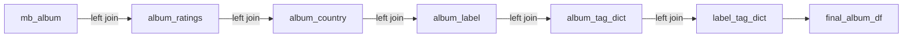
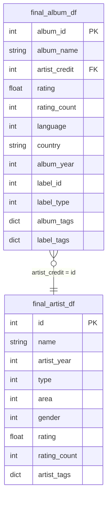

# Datasets — Building DataFrames

**Notebook:** `1-data/02-parquet-to-dataframes.ipynb`

Loads the raw Parquet files into pandas DataFrames, enriches them, and persists the results as pickles for use in the EDA notebooks.

## Output files

| File | Description |
|------|-------------|
| `data/pickles/final_album_df.pkl` | One row per album with all scalar features and tag dicts |
| `data/pickles/final_artist_df.pkl` | One row per artist with scalar features and tag dict |

## Processing steps

### 1. Load raw Parquet tables

```python
artists      = pd.read_parquet('data/mb_artist.parquet')
artist_tags  = pd.read_parquet('data/mb_artist_tag.parquet')
# ... all 10 tables
```

### 2. Aggregate tags into dicts

Tags are stored as one row per (album/artist, tag). They are grouped into `{tag_id: tag_count}` dicts per entity:

```python
album_tag_dict   = album_tags.groupby('album_id').apply(lambda x: dict(...))
artist_tag_dict  = ...  # artist tags mapped onto albums via artist_credit
label_tag_dict   = ...  # label tags mapped onto albums via album_label
```

### 3. Build `final_album_df`

Left-joins albums with ratings, country, label, and all three tag dicts:



**Columns:** `album_id`, `album_name`, `artist_credit`, `rating`, `rating_count`, `language`, `country`, `album_year`, `label_id`, `label_type`, `album_tags`, `label_tags`

### 4. Build `final_artist_df`

Left-joins artists with ratings and aggregated artist tag dict.

**Columns:** `id`, `name`, `artist_year`, `type`, `area`, `gender`, `rating`, `rating_count`, `artist_tags`

## Join diagram


