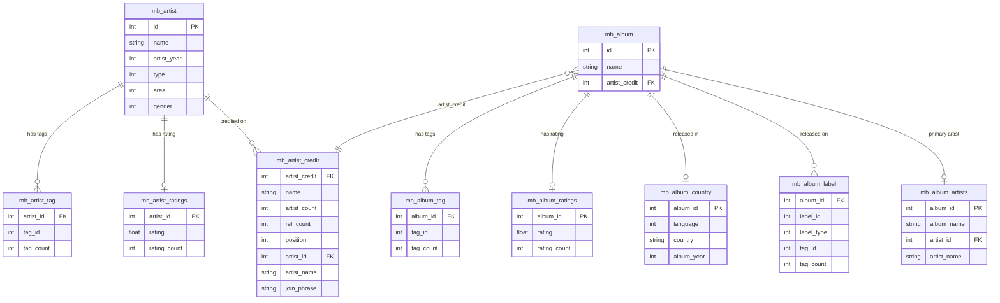

# Data Import — Parquet Tables

**Notebook:** `1-EDA/01-postgres-to-parquet.ipynb`

Connects to a local MusicBrainz PostgreSQL instance via DuckDB's Postgres extension, then exports filtered subsets to compressed Parquet files in `data/`.

## Prerequisites

- MusicBrainz PostgreSQL database running at `localhost:5432`
- Connection credentials in `.env` (see `.env.example`)

## How it works

DuckDB attaches to Postgres as a read-only data source:

```python
duck_con.execute("""INSTALL postgres; LOAD postgres;""")
duck_con.execute(f"""
    ATTACH IF NOT EXISTS 'host=... dbname=musicbrainz_db ...'
    AS mb_pg (TYPE postgres, READ_ONLY);
""")
```

Each table is exported with `COPY (...) TO '../data/<name>.parquet' (FORMAT 'PARQUET', COMPRESSION 'ZSTD')`.

## Tables exported

### Artist tables

| File | Source | Key fields |
|------|--------|------------|
| `mb_artist.parquet` | `musicbrainz.artist` | `id`, `name`, `artist_year`, `type`, `area`, `gender` |
| `mb_artist_tag.parquet` | `musicbrainz.artist_tag` | `artist_id`, `tag_id`, `tag_count` |
| `mb_artist_ratings.parquet` | `musicbrainz.artist_meta` | `artist_id`, `rating`, `rating_count` |
| `mb_artist_credit.parquet` | `artist_credit` + `artist_credit_name` | `artist_credit`, `name`, `artist_count`, `ref_count`, `position`, `artist_id`, `artist_name`, `join_phrase` |

### Album tables

| File | Source | Key fields |
|------|--------|------------|
| `mb_album.parquet` | `musicbrainz.release_group` (type=1) | `id`, `name`, `artist_credit` |
| `mb_album_tag.parquet` | `release_group_tag` | `album_id`, `tag_id`, `tag_count` |
| `mb_album_ratings.parquet` | `release_group_meta` | `album_id`, `rating`, `rating_count` |
| `mb_album_country.parquet` | `release` + `release_country` | `album_id`, `language`, `country`, `album_year` |
| `mb_album_label.parquet` | `release_label` + `label` + `label_tag` | `album_id`, `label_id`, `label_type`, `tag_id`, `tag_count` |
| `mb_album_artists.parquet` | `release_group` + `artist_credit_name` | `album_id`, `album_name`, `artist_id`, `artist_name` |

## Schema diagram



## Notes

- Only `release_group` records with `type = 1` (albums) are imported — singles, EPs, etc. are excluded.
- `mb_album_country` keeps only the earliest release per album (ordered by date ASC).
- `mb_album_label` keeps only the label with the highest tag count per album.
- `mb_artist_credit` excludes type=1 release groups (album artist credits are captured separately in `mb_album_artists`).
- Various Artists releases (`artist = 1`) are nulled out in `mb_album_artists`.
