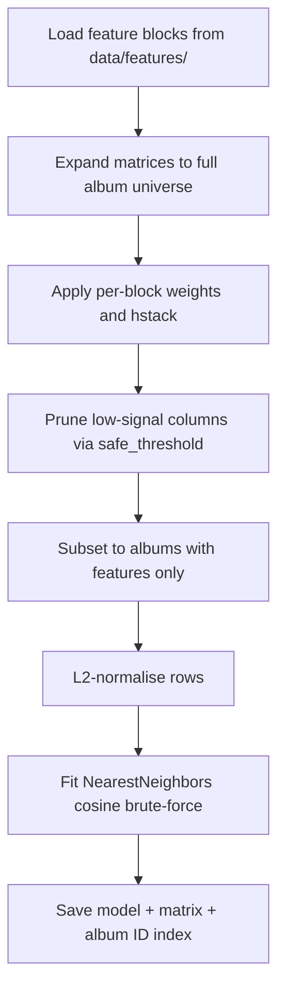

# Model — KNN Training & Query

**Notebooks:** `2-Prototyping/04-knn-training.ipynb` (v1), `11-knn-v2-training.ipynb` (v2), `12-knn-v3-training.ipynb` (v3)

Three KNN model versions, each adding more features. All share the same training pipeline and query logic.

## Model versions

| Version | New features vs previous | Features (post-prune) | Notebook |
|---------|--------------------------|-----------------------|----------|
| v1 | baseline | 5,647 | 04-knn-training.ipynb |
| v2 | + artist country, track stats | 5,854 | 11-knn-v2-training.ipynb |
| v3 | + combined genre tags (album+artist+label) | 9,810 | 12-knn-v3-training.ipynb |

## Output files

| Path | Description |
|------|-------------|
| `data/model/knn_model.joblib` | v1 fitted model |
| `data/model/X_knn_norm.npz` | v1 L2-normalised matrix |
| `data/model/album_ids_annotated.npy` | v1 album ID index |
| `data/model_v2/knn_model_v2.joblib` | v2 fitted model |
| `data/model_v2/X_knn_norm_v2.npz` | v2 L2-normalised matrix |
| `data/model_v2/album_ids_annotated_v2.npy` | v2 album ID index |
| `data/model_v3/knn_model_v3.joblib` | v3 fitted model |
| `data/model_v3/X_knn_norm_v3.npz` | v3 L2-normalised matrix |
| `data/model_v3/album_ids_annotated_v3.npy` | v3 album ID index |

## Training pipeline



### Matrix expansion

Feature matrices are built over the annotated album subset (1,008,102 albums). Before training, they are expanded to the full album universe from `mb_album.parquet` (2,241,402 albums), inserting zero rows for albums with no data:

```python
full_album_ids = pd.Index(pd.read_parquet('data/mb_album.parquet', columns=['id'])['id'].sort_values())
# zero-fill missing rows via sparse COO re-index
```

### L2 normalisation

Rows are L2-normalised so cosine similarity reduces to a dot product at query time:

```python
X_knn_norm = normalize(X_knn_annotated, norm='l2')
```

### Model configuration

```python
model = NearestNeighbors(metric='cosine', algorithm='brute', n_jobs=-1)
```

Brute force is used because the matrix is sparse and high-dimensional — tree-based methods offer no speed advantage in this regime.

## Recommendation query

Given a seed album:

1. Look up the album's row in `X_knn_norm` via `album_id_to_row`.
2. Fetch `n * 5` nearest neighbours to absorb same-artist exclusions.
3. Filter out the seed album itself and any albums by the same primary artist.
4. Return the first `n` results.

```python
distances, indices = model.kneighbors(X_knn_norm[row], n_neighbors=n * 5)
```

Albums with no features cannot be used as query seeds and return an empty result.
