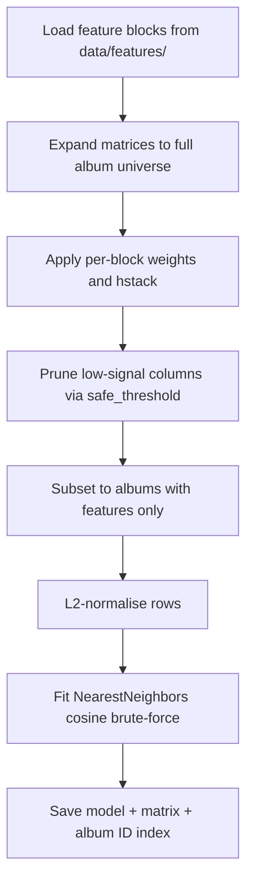

# Model — KNN Training & Query

**Notebooks:** `4-model/01-knn-v1-training.ipynb` (v1), `4-model/03-knn-v2-training.ipynb` (v2), `4-model/04-knn-v3-training.ipynb` (v3), `4-model/05-knn-v4-training.ipynb` (v4 — in progress). Evaluation in `4-model/06-evaluate-lastfm.ipynb`. Weight tuning experiments in `4-model/tuning/`.

Three shipped KNN model versions, each adding more features. All share the same training pipeline and query logic.

## Model versions

Numbers are after the album-scope rebuild (universe = 1,758,488).

| Version | New features vs previous | Features (post-prune) | Albums indexed | Notebook |
|---------|--------------------------|-----------------------|----------------|----------|
| v1 | baseline (tags · labels · types · ratings) | 5,653 | 1,070,021 | 01-knn-v1-training.ipynb |
| v2 | + artist country, track stats | 7,679 | 1,758,005 | 03-knn-v2-training.ipynb |
| v3 | genre tags (album+artist+label) + consolidated record_label | 15,247 | 1,758,047 | 04-knn-v3-training.ipynb |
| v4 | + era, further feature work | TBD | TBD | 05-knn-v4-training.ipynb |

v1/v2 use the separate `album_labels_matrix` + `album_types_matrix`; v3 uses the combined `album_record_label_matrix`. v2/v3 index far more albums than v1 because their dense country/track-stats blocks give nearly every album some signal, whereas v1's tag-only feature set leaves ~0.7M albums empty.

**v4 is in progress** — `05-knn-v4-training.ipynb` and the tuning notebooks in `4-model/tuning/` are experimental. `06-evaluate-lastfm.ipynb` evaluates recommendation quality against Last.fm listening data. The current production app (`app_v3_weighted.py`) does not use a trained model artefact — it applies weights at runtime directly over the raw feature matrices.

> **Note:** the trained model artefacts (`data/model/`, `data/model_v2/`, `data/model_v3/`) are gitignored — large and regenerable. The current app (`app_v3_weighted.py`) reads the raw feature matrices directly and needs no trained model; see [05-app.md](05-app.md).

## Output files

| Path | Description |
|------|-------------|
| `data/model/knn_model.joblib` | v1 fitted model |
| `data/model/X_knn_norm.npz` | v1 L2-normalised matrix |
| `data/model/album_ids_annotated.npy` | v1 album ID index |
| `data/model_v2/knn_model_v2.joblib` | v2 fitted model |
| `data/model_v2/X_knn_norm_v2.npz` | v2 L2-normalised matrix |
| `data/model_v2/album_ids_annotated_v2.npy` | v2 album ID index |
| `data/model_v3/knn_model_v3.joblib` | v3 fitted model |
| `data/model_v3/X_knn_norm_v3.npz` | v3 L2-normalised matrix |
| `data/model_v3/album_ids_annotated_v3.npy` | v3 album ID index |

## Training pipeline



### Matrix expansion

Feature matrices are saved at the full album universe (1,758,488 albums) from `mb_album.parquet`, so the expansion step in each training notebook is now mostly a no-op — but it is retained so the pipeline still works if a feature block is ever built over a subset. Any albums missing from a block get zero rows:

```python
full_album_ids = pd.Index(pd.read_parquet('data/mb_album.parquet', columns=['id'])['id'].sort_values())
# zero-fill missing rows via sparse COO re-index
```

All blocks must share this row dimension before `hstack` — a mismatch (e.g. a block left at the 1M annotated subset) raises a dimension error.

### L2 normalisation

Rows are L2-normalised so cosine similarity reduces to a dot product at query time:

```python
X_knn_norm = normalize(X_knn_annotated, norm='l2')
```

### Model configuration

```python
model = NearestNeighbors(metric='cosine', algorithm='brute', n_jobs=-1)
```

Brute force is used because the matrix is sparse and high-dimensional — tree-based methods offer no speed advantage in this regime.

## Recommendation query

Given a seed album:

1. Look up the album's row in `X_knn_norm` via `album_id_to_row`.
2. Fetch `n * 5` nearest neighbours to absorb same-artist exclusions.
3. Filter out the seed album itself and any albums by the same primary artist.
4. Return the first `n` results.

```python
distances, indices = model.kneighbors(X_knn_norm[row], n_neighbors=n * 5)
```

Albums with no features cannot be used as query seeds and return an empty result.
