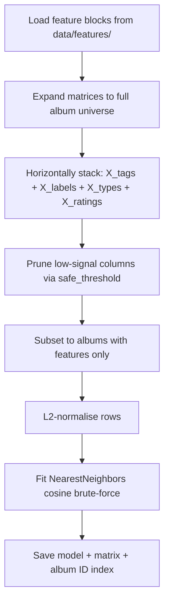

# Model — KNN Training & Query

**Notebooks:** `model/knn.ipynb`, `model/knn-query.ipynb`

Trains a K-Nearest Neighbours model on the sparse feature matrix and provides a query interface for album recommendations.

## Output files (`data/model/`)

| File | Description |
|------|-------------|
| `knn_model.joblib` | Fitted `sklearn.neighbors.NearestNeighbors` model |
| `X_knn_norm.npz` | L2-normalised sparse feature matrix (only albums with features) |
| `album_ids_annotated.npy` | Array of album IDs corresponding to rows in `X_knn_norm` |
| `has_features.npy` | Boolean mask over the full album universe |

## Training pipeline



### Matrix expansion

The feature notebooks may build matrices over a subset of albums. Before training, matrices are expanded to the full album universe from `mb_album.parquet`, inserting zero rows for albums with no data:

```python
full_album_ids = pd.Index(pd.read_parquet('data/mb_album.parquet', columns=['id'])['id'].sort_values())
# zero-fill missing rows via sparse COO re-index
```

### L2 normalisation

Rows are L2-normalised so cosine similarity reduces to a dot product at query time (faster with brute-force search):

```python
X_knn_norm = normalize(X_knn_annotated, norm='l2')
```

### Model configuration

```python
model = NearestNeighbors(metric='cosine', algorithm='brute', n_jobs=-1)
```

Brute force is used because the matrix is sparse and high-dimensional — tree-based methods offer no speed advantage in this regime.

## Recommendation query

Given a seed album, the query logic:

1. Looks up the album's row in `X_knn_norm` via `album_id_to_row`.
2. Fetches `n * 5` nearest neighbours to absorb same-artist exclusions.
3. Filters out the seed album itself and any albums by the same primary artist.
4. Returns the first `n` results.

```python
distances, indices = model.kneighbors(X_knn_norm[row], n_neighbors=n * 5)
```

Albums with no features (`has_features = False`) cannot be used as query seeds and return an empty result in the app.
