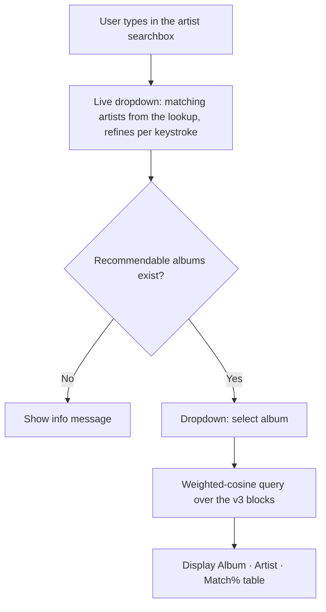

# Streamlit App

**Files:** `5-app/app.py` (v1), `5-app/app_v2.py` (v1 vs v2), `5-app/app_v3.py` (v1 vs v2 vs v3), `5-app/app_v3_weighted.py` (v3 with weight knobs + filters — **current**), `5-app/app_v6.py` (experimental on-the-fly cosine with v3/v4 features)

`app_v3_weighted.py` is the current active app.

## Running the app

```bash
source env/bin/activate
streamlit run 5-app/app_v3_weighted.py
```

The app opens at `http://localhost:8501` by default.

## App versions

| File | What it does | Loads |
|------|-------------|-------|
| `app.py` | v1 only, single model | `data/model/` joblib |
| `app_v2.py` | v1 vs v2 side-by-side | `data/model/`, `data/model_v2/` joblibs |
| `app_v3.py` | v1 vs v2 vs v3 side-by-side | all three joblibs |
| `app_v3_weighted.py` | **v3 features with runtime weight knobs + album filters (current)** | raw feature matrices + flag parquets — no trained model |
| `app_v6.py` | experimental — on-the-fly cosine with v3/v4 features | raw feature matrices |

The comparison apps (`app_v2.py`, `app_v3.py`) load trained `.joblib` models, which are **not
committed** (gitignored) — retrain via the v2/v3 notebooks to use them. The current weighted app
needs only the committed feature matrices.

## Weighted app — `app_v3_weighted.py`

Instead of a pre-fitted KNN model, this app loads raw feature blocks (genre, record_label,
ratings, country, track_stats, era, and optionally popularity) and precomputes each block's per-album sum-of-squares once at startup. Sidebar **knobs** set a weight per block; per query it computes weighted cosine directly:

```
numerator   = Σ_b w_b² · (X_b · q_b)
album norms = sqrt(Σ_b w_b² · ssq_b)
cosine      = numerator / (album_norms · query_norm)
```

No full-matrix rebuild or renormalisation per query (~60–180 ms over the 1.76M-album index).
The album dropdown is filtered to albums that have signal under the *current* weights, so it
never offers an album that would return no recommendations.

### Feature knobs

The sidebar header reads **"Tune your sound"**. Each feature block is a guitar-amp-style rotary
knob (custom component, `5-app/knob_component/index.html`) reading **0–11**, mapped to a block
weight by `dial_to_weight(d) = d/11·2.0` (0 → off, 11 → 2.0 max). Click a tick around the ring to
set a value. Defaults (dial units): Country = 2, Era = 4, Popularity = 4 (both moderate — soft signals), and the
rest = 6 (mirroring the v3 training weights); a "Preset" button restores them via an `on_click`
callback. The active weights are echoed under the results as an **"EQ — …"** caption.

The app always shows **5 knobs** — Genre, Record Label, Track Stats, Country, Era — plus a 6th **Popularity** knob that appears automatically when `data/features/album_lastfm_popularity_matrix.npz` exists. If the file is missing an info message is shown and the app falls back gracefully.

**Ratings has no knob.** The ratings block is always loaded but its weight is not user-controllable. Instead it **auto-syncs to the Popularity dial** — turning up Popularity boosts both Last.fm listener/scrobble signal and community ratings together, treating them as complementary engagement measures. When the popularity file is missing, ratings defaults to a fixed weight of dial 6 (≈ 1.09).

Results render as a three-column table — **Album · Artist · Match** — where Match is the weighted
cosine shown as a right-aligned percentage to one decimal (`st.column_config.NumberColumn`,
`format='%.1f%%'`, pinned narrow via an integer pixel `width`).

### Album filters

Two mixing-console-style **vertical faders** below the knobs (custom component,
`5-app/knob_component/switch.html`, placed side by side with `st.columns(2)`) filter results by
MusicBrainz release-group **secondary type** — an exact schema lookup, not an album-name guess.
Each fader has three detents with the option labels at top / middle / bottom; click a label or
anywhere along the track to slide the cap.

| Fader | Options | Keeps |
|-------|---------|-------|
| **Live Albums** | Live · Both · Studio | Live = secondary type Live (6); Studio = everything else |
| **Greatest Hits** | Hits · Both · Albums | Hits = secondary type Compilation (1); Albums = everything else |

Both default to **Both** and chain on both the artist-album dropdown and the recommendation
results, via the generic `filter_by_flag()` helper. The flags are pre-exported to
`data/mb_album_live_flag.parquet` and `data/mb_album_compilation_flag.parquet` (single `album_id`
column each) by the matching `1-data/queries/*_flag_duckdb.sql`, then loaded into sets by
`load_flag_ids()`. This replaced an earlier album-name keyword heuristic that mis-classified
titles with no "live" keyword (e.g. "Set List", date-format concert titles).

### Custom widget plumbing & state model

Both the knob panel and the fader switches are custom HTML/SVG components served from a small
background `HTTPServer` thread on port 8502 and registered with `declare_component(url=...)`
(Streamlit's built-in component file server failed in this environment). All outbound messages to
Streamlit must include `isStreamlitMessage: true`.

Each widget is the **single source of truth** for its own value — there is no `session_state`
mirror, so the knobs and the two faders move fully independently. Streamlit persists a keyed
component's last emitted value; the knob panel is re-seeded from that persisted value each rerun so
a silent iframe remount restores the user's dials rather than snapping to defaults. After first
render every iframe **ignores ordinary inbound renders** — only a change to the knob panel's
`reset_nonce` arg (flipped by the "Preset" button) makes it re-apply (using each knob's
`defaultValue`) and re-emit so the Python side stays in sync. The faders have no external reset, so
they ignore all inbound renders after init. This event-based scheme replaced an earlier 600 ms
time-window guard that caused cross-widget glitches and a stale-value "memory" bug.

**Various-Artists releases are excluded from recommendations.** ~1.5% of the index (VA samplers
and compilations that slipped past the import filter via the studio branch) have a null
`artist_name`; `recommend()` skips them, since a release with no single artist isn't actionable
here. Seeds are unaffected — the album dropdown is always built from a selected real artist.

## User flow



In `app_v3_weighted.py` the artist step is a `streamlit-searchbox` typeahead (`st_searchbox`):
matches from the lookup appear and refine as you type. `artist_index()` caches the ~566k unique
names with a lowercased column for fast per-keystroke substring matching; `make_artist_search()`
returns the callback (150 ms debounce, prefix hits first, capped at 50). Picking a suggestion goes
straight to the album dropdown — it replaced the old text input + separate artist selectbox.

## Data loaded at startup

All resources are cached with `@st.cache_resource` and load once per server process:

| Resource | Source | Purpose |
|----------|--------|---------|
| genre matrix | `data/features/album_genre_matrix.npz` | Genre feature block |
| record_label matrix | `data/features/album_record_label_matrix.npz` | Label feature block |
| ratings matrix | `data/features/album_ratings_matrix.npz` | Ratings feature block |
| country matrix | `data/features/album_country_matrix.npz` | Country feature block |
| track_stats matrix | `data/features/album_track_stats_matrix.npz` | Track stats feature block |
| era matrix | `data/features/album_era_matrix.npz` | Era feature block |
| popularity matrix | `data/features/album_lastfm_popularity_matrix.npz` | Popularity feature block (optional — loaded if present) |
| album index | `data/features/album_ids.pkl` | Master row index |
| lookup table | `data/mb_album_artists.parquet` | Maps album IDs to names and artist names |
| live flag | `data/mb_album_live_flag.parquet` | Live Albums fader filter |
| compilation flag | `data/mb_album_compilation_flag.parquet` | Greatest Hits fader filter |

## Highlight logic (`app_v3.py`)

Rows are highlighted amber when an album appears in **only that model's** results and not in either of the other two. Plain rows appear in at least one other model.

```python
def highlight_unique(df, other_ids):
    return [
        'background-color: #fff3cd; ...' if aid not in other_ids else ''
        for aid in df['album_id']
    ]
```

The summary line below the tables shows how many albums appear in all three, and the unique count per model.

## Key functions

### `make_artist_search(lookup, limit=50)` / `artist_index(lookup)`
Build the `st_searchbox` callback for the artist typeahead. `artist_index()` caches the unique
artist names with a precomputed lowercased column; the callback does a case-insensitive substring
match, orders prefix hits first, and caps the suggestion list at `limit`.

### `search_artist(name, lookup)`
Case-insensitive partial string match on `artist_name`, returning all matching rows. Retained as a
helper (the comparison apps still use it); the current app's artist field uses the typeahead above.

### `recommend(album_id, n, model, X_knn_norm, album_ids_annotated, album_id_to_row, lookup)`
Runs a KNN query for the given album across one model, fetches `n * 5` candidates, then:
- Removes the seed album itself
- Removes other albums by the same primary artist

Returns a DataFrame with `Album`, `Artist`, and `album_id` columns, truncated to `n` rows. Returns `None` if the album has no features in this model.

### `render_model_col(label, recs, other_ids)`
Renders one column: applies the highlight style and calls `st.dataframe`. Shared across all three columns to keep rendering DRY.
