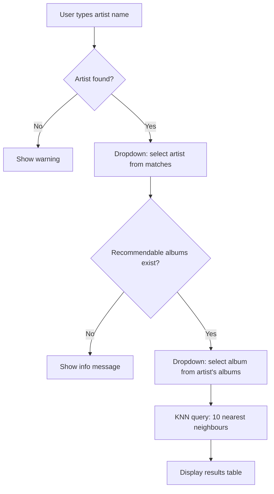

# Streamlit App

**File:** `app/app.py`

A single-page Streamlit app that lets users search for an artist, select an album they like, and receive 10 similar album recommendations from the KNN model.

## Running the app

```bash
source env/bin/activate
streamlit run app/app.py
```

The app opens at `http://localhost:8501` by default.

## User flow



## Data loaded at startup

Both resources are cached with `@st.cache_resource` so they load once per server process:

| Resource | Source | Purpose |
|----------|--------|---------|
| KNN model + matrix | `data/model/` | Runs recommendations |
| Lookup table | `data/mb_album_artists.parquet` | Maps album IDs to names and artist names |

The album dropdown is filtered to only albums present in `album_id_to_row` — albums with no feature data are hidden so the user can never select an unresolvable seed.

## Key functions

### `search_artist(name, lookup)`
Case-insensitive partial string match on `artist_name`. Returns all matching rows from the lookup table.

### `recommend(album_id, n, ...)`
Runs a KNN query for the given album, fetches `n * 5` candidates, then filters:
- Removes the seed album itself
- Removes other albums by the same primary artist

Returns a DataFrame with `Album` and `Artist` columns, truncated to `n` rows.
