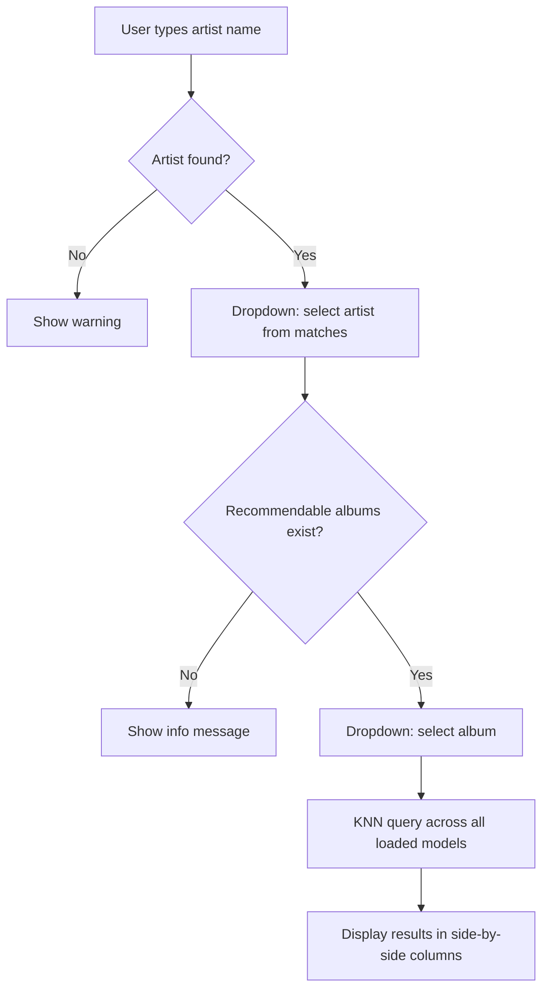

# Streamlit App

**Files:** `3-app/app.py` (v1), `3-app/app_v2.py` (v1 vs v2), `3-app/app_v3.py` (v1 vs v2 vs v3), `3-app/app_v3_weighted.py` (v3 with weight sliders)

`app_v3_weighted.py` is the current active app.

## Running the app

```bash
source env/bin/activate
streamlit run 3-app/app_v3_weighted.py
```

The app opens at `http://localhost:8501` by default.

## App versions

| File | What it does | Loads |
|------|-------------|-------|
| `app.py` | v1 only, single model | `data/model/` joblib |
| `app_v2.py` | v1 vs v2 side-by-side | `data/model/`, `data/model_v2/` joblibs |
| `app_v3.py` | v1 vs v2 vs v3 side-by-side | all three joblibs |
| `app_v3_weighted.py` | **v3 features with runtime weight sliders (current)** | raw feature matrices — no trained model |

The comparison apps (`app_v2.py`, `app_v3.py`) load trained `.joblib` models, which are **not
committed** (gitignored) — retrain via the v2/v3 notebooks to use them. The current weighted app
needs only the committed feature matrices.

## Weighted app — `app_v3_weighted.py`

Instead of a pre-fitted KNN model, this app loads the five raw v3 feature blocks (genre,
record_label, ratings, country, track_stats) and precomputes each block's per-album
sum-of-squares once at startup. Sidebar sliders set a weight per block; per query it computes
weighted cosine directly:

```
numerator   = Σ_b w_b² · (X_b · q_b)
album norms = sqrt(Σ_b w_b² · ssq_b)
cosine      = numerator / (album_norms · query_norm)
```

No full-matrix rebuild or renormalisation per query (~60–180 ms over the 1.76M-album index).
Sliders default to the v3 training weights (country 0.2, others 1.0); a reset button restores
them via an `on_click` callback. The album dropdown is filtered to albums that have signal under
the *current* weights, so it never offers an album that would return no recommendations.

**Various-Artists releases are excluded from recommendations.** ~1.5% of the index (VA samplers
and compilations that slipped past the import filter via the studio branch) have a null
`artist_name`; `recommend()` skips them, since a release with no single artist isn't actionable
here. Seeds are unaffected — the album dropdown is always built from a selected real artist.

## User flow



## Data loaded at startup

All resources are cached with `@st.cache_resource` and load once per server process:

| Resource | Source | Purpose |
|----------|--------|---------|
| v1 model + matrix | `data/model/` | Runs v1 recommendations |
| v2 model + matrix | `data/model_v2/` | Runs v2 recommendations |
| v3 model + matrix | `data/model_v3/` | Runs v3 recommendations |
| Lookup table | `data/mb_album_artists.parquet` | Maps album IDs to names and artist names |

The album dropdown is filtered to albums present in any model's index — albums with no features in any model are hidden.

## Highlight logic (`app_v3.py`)

Rows are highlighted amber when an album appears in **only that model's** results and not in either of the other two. Plain rows appear in at least one other model.

```python
def highlight_unique(df, other_ids):
    return [
        'background-color: #fff3cd; ...' if aid not in other_ids else ''
        for aid in df['album_id']
    ]
```

The summary line below the tables shows how many albums appear in all three, and the unique count per model.

## Key functions

### `search_artist(name, lookup)`
Case-insensitive partial string match on `artist_name`. Returns all matching rows from the lookup table.

### `recommend(album_id, n, model, X_knn_norm, album_ids_annotated, album_id_to_row, lookup)`
Runs a KNN query for the given album across one model, fetches `n * 5` candidates, then:
- Removes the seed album itself
- Removes other albums by the same primary artist

Returns a DataFrame with `Album`, `Artist`, and `album_id` columns, truncated to `n` rows. Returns `None` if the album has no features in this model.

### `render_model_col(label, recs, other_ids)`
Renders one column: applies the highlight style and calls `st.dataframe`. Shared across all three columns to keep rendering DRY.
